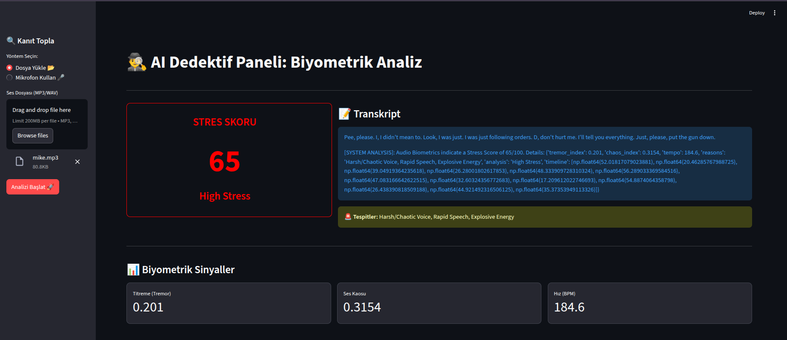
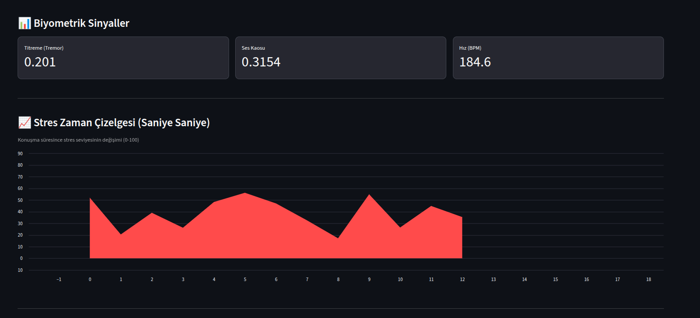
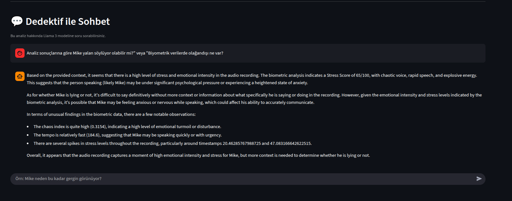

# AI Lie Detector & Biometric Analysis Platform
### (Yapay Zeka Destekli Yalan Dedektörü ve Biyometrik Ses Analiz Platformu)

> Ses tonundaki mikro titreşimleri, kaosu ve biyometrik verileri analiz ederek stres seviyesini ölçen ve Llama 3 (LLM) ile detaylı psikolojik rapor sunan mikroservis tabanlı analiz sistemi.

## Proje Hakkında

Bu proje, standart ses analizlerinin ötesine geçerek, insan kulağının duyamayacağı biyometrik sinyalleri (**Jitter, Shimmer, Pitch, Entropy**) inceler.

Ses dosyasını saniye saniye tarayarak konuşmacının hangi anlarda strese girdiğini, ne zaman yalan söyleme eğilimi gösterdiğini veya paniklediğini tespit eder.

Elde edilen tüm teknik veriler vektör veritabanına (**Qdrant**) işlenir ve **RAG (Retrieval-Augmented Generation)** teknolojisi kullanılarak kullanıcıya **"Sanal Bir Dedektif" (Llama 3)** ile sohbet etme imkanı sunulur.

## Temel Özellikler

### 1.  Biyometrik Ses Analizi
* **Tremor (Titreme):** Ses tellerindeki mikro kararsızlıkları ölçer (Korku belirtisi).
* **Chaos (Entropi):** Sesteki bozulma ve gürültü oranını analiz eder (Panik/Öfke belirtisi).
* **Tempo (BPM):** Konuşma hızını takip eder.
* **Enerji (Loudness):** Ani ses patlamalarını ve bağırma anlarını yakalar.

### 2.  Saniye Saniye Stres Grafiği (Timeline)
Sadece genel bir skor vermekle kalmaz, konuşmanın başından sonuna kadar stres seviyesinin değişimini **Kırmızı Alan Grafiği** ile görselleştirir.

### 3.  AI Dedektif (Llama 3 Entegrasyonu)
Analiz bittikten sonra sistemle sohbet edebilirsiniz.

> **Örn:** "Mike tam olarak nerede panikledi?", "Yalan söylüyor olabilir mi?"

Sistem, **Qdrant** hafızasındaki biyometrik verileri okuyarak kanıta dayalı cevaplar verir.

### 4.  Çoklu Giriş Desteği
* **MP3/WAV** dosya yükleme.
* Tarayıcı üzerinden **Canlı Mikrofon Kaydı**.

### 5. ⚡ Yüksek Performanslı Mimari
* **Go (Golang):** Yüksek hızlı API Gateway ve istek yönetimi.
* **Python Worker:** Ağır matematiksel işlemler ve AI analizi için optimize edilmiş asenkron işçi.
* **RabbitMQ:** Servisler arası kayıpsız mesajlaşma kuyruğu.

##  Teknoloji Yığını (Tech Stack)

| Alan | Teknoloji | Neden Seçildi? |
| :--- | :--- | :--- |
| **Backend** | Go (Fiber) | Ultra düşük gecikme süresi ve yüksek eşzamanlılık (Concurrency) için. |
| **AI Worker** | Python 3.9 | Librosa, NumPy, SciPy ve Torch ekosistemi için standart. |
| **Frontend** | Streamlit | Hızlı veri görselleştirme ve interaktif dashboard için. |
| **Database** | Qdrant | RAG (Retrieval-Augmented Generation) için vektör arama motoru. |
| **Message Broker** | RabbitMQ | Servisleri birbirinden koparmak (Decoupling) ve yük dengeleme için. |
| **LLM** | Ollama (Llama 3) | Lokal olarak çalışan, gizlilik odaklı güçlü dil modeli. |
| **DevOps** | Docker Compose | Tek komutla tüm ortamı ayağa kaldırmak için. |

##  Kurulum ve Çalıştırma

Projeyi yerel makinenizde çalıştırmak için sadece **Docker** gereklidir.

### Ön Hazırlık
Bilgisayarınızda **Docker Desktop** kurulu olduğundan emin olun.

### Adım 1: Projeyi Klonlayın

```bash
git clone [https://github.com/kullaniciadi/private-whisperss.git](https://github.com/kullaniciadi/private-whisperss.git)
cd private-whisperss
```

### Adım 2: Docker ile Başlatın

Tüm servisleri (Frontend, Backend, Database, AI) tek komutla ayağa kaldırın:

```bash
docker compose up -d --build
```

### Adım 3: Kullanım

Tarayıcınızı açın ve şu adrese gidin:

http://localhost:8501

## Kullanım Senaryosu

1. **Veri Girişi:** Sol menüden bir ses dosyası yükleyin veya mikrofon butonuna basarak konuşun.
2. **İşlem:** Sistem dosyayı kuyruğa alır. **Worker** arka planda sesi işler (Loglardan takip edilebilir).
### 3. Sonuç Ekranı

* **Stres Skoru:** 0-100 arası puan (Yeşil: Sakin, Kırmızı: Yüksek Stres).
* **Biyometrik Sinyaller:** Titreme ve Kaos değerleri.
* **Timeline Grafiği:** Sesin hangi saniyesinde stresin arttığını gösteren kırmızı alan grafiği.
* **Dedektif Modu:** Sayfanın en altındaki sohbet kutusuna `"Neden yalan söylediğini düşünüyorsun?"` yazarak yapay zeka ile tartışın.

## Ekran Görüntüleri

##  Yüksek Stres Tespiti (Panik Anı)
Sistemin, titreyen ve hızlı konuşan bir sesi tespit edip "High Stress" (65/100) olarak işaretlediği an.



##  Saniye Saniye Stres Grafiği (Timeline)
Kullanıcının bağırdığı anı yakalayan kırmızı alan grafiği.



## Yapay Zeka Dedektifi ile Sohbet
Llama 3 modelinin biyometrik verileri yorumlayarak rapor vermesi.
